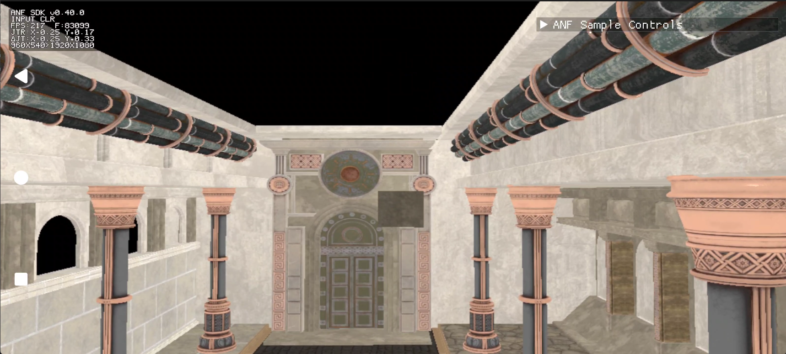
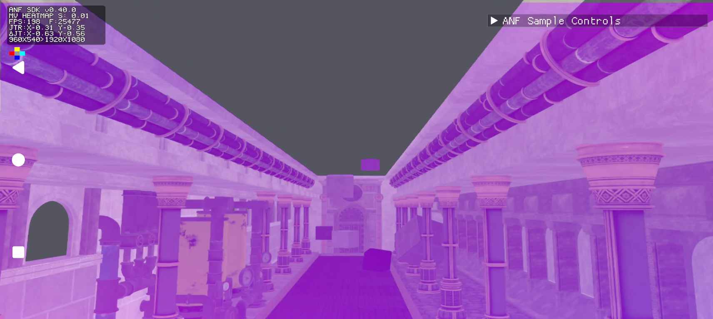
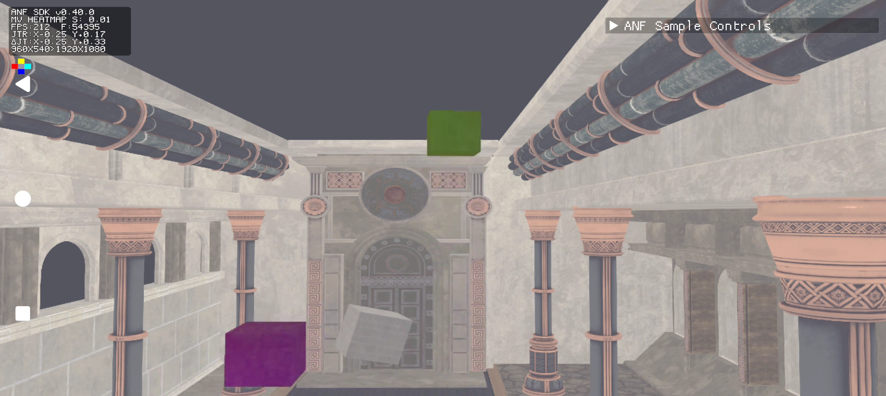
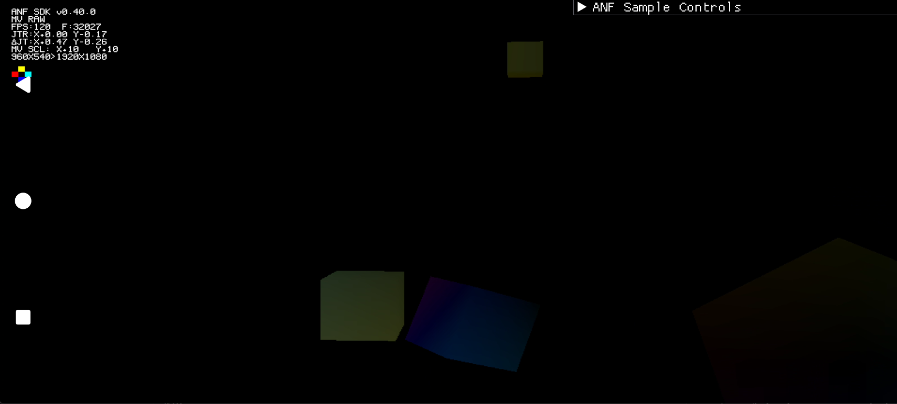
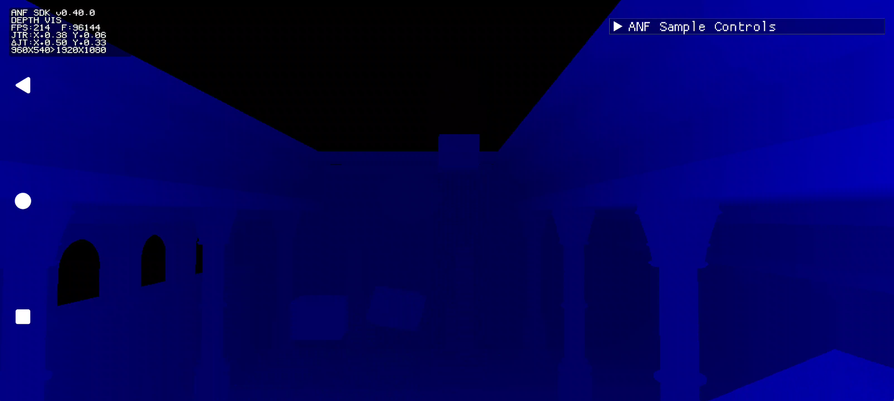
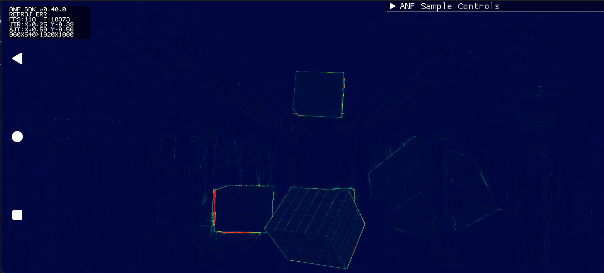
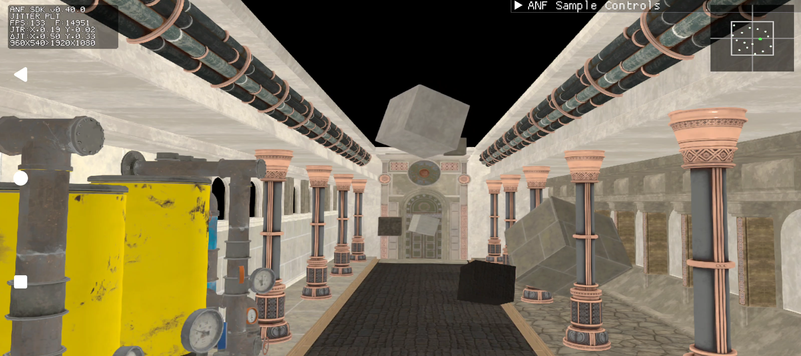

# Adrenoâ„¢ Neural Fusion (ANF) SDK debug overlay guide

This guide explains how to enable and use the ANF debug overlay when integrating Super Resolution (SR) into an Android Vulkan renderer.

The overlay displays the color, depth, motion-vector, and jitter data supplied to ANF. Some modes blend diagnostic data over the SR output. Other modes replace the displayed output with an input or derived image. The overlay runs as part of the SR dispatch and modifies the output before later application passes.

The current overlay supports SR only. Use it during integration and validation, not as a production HUD.

## Unreal plugin controls

Enable SR and set `r.ANF.DebugOverlay.Allowed=1` before creating the ANF instance. Select a visualization with `r.ANF.DebugOverlay.Mode`. The plugin recreates its ANF instance when the allowed setting changes; prefer configuring it before starting the test.

For a motion-vector heatmap, use `r.ANF.DebugOverlay.Mode 2` and adjust `r.ANF.DebugOverlay.MvHeatmapScale`. Modes 0 through 8 match the SDK modes listed below. The plugin also exposes scale, jitter, depth, and HUD controls under `r.ANF.DebugOverlay.*` in `ANFConfig.cpp`.

Set `r.ANF.DebugOverlay.Mode=0` to stop drawing. Set `r.ANF.DebugOverlay.Allowed=0` before production initialization to avoid creating the overlay.

The native examples below explain SDK behavior. Unreal applications normally use the plugin controls instead of calling these functions directly.

## Contents

- [Before you begin](#before-you-begin)
- [Enable the overlay](#enable-the-overlay)
- [Configure an SR dispatch](#configure-an-sr-dispatch)
- [HUD](#hud)
- [Overlay modes](#overlay-modes)
- [Verify the SR integration](#verify-the-sr-integration)
- [Diagnose SR artifacts](#diagnose-sr-artifacts)
- [Troubleshoot the overlay](#troubleshoot-the-overlay)
- [Disable the overlay for production](#disable-the-overlay-for-production)
- [Configuration reference](#configuration-reference)
- [Related resources](#related-resources)

## Before you begin

Complete the base SR integration before adding the overlay. The application must already create an ANF instance and SR technique, query resource requirements, prepare the SR resources, and submit `AnfTechniqueDispatchInfo` with an `AnfSRDispatch` structure.

Keep these constraints in mind:

- The application must enable the overlay when it creates the ANF instance.
- Enabling the overlay changes the Vulkan image usage requirements returned by ANF.
- The SDK maintains one overlay per ANF instance. One technique owns that overlay at a time.
- When replacing an SR technique, destroy the existing technique before creating its replacement.
- Overlay settings persist until the application submits another `AnfDebugOverlayConfig`.
- Input and output resources must remain valid until the dispatch completes.
- Per-frame resource buffering must support the `maxInFlight` value used to create the technique.

The overlay writes into the SR output before later rendering passes. Tone mapping, color grading, sharpening, bloom, film grain, and UI composition can change or cover the overlay. If the overlay appears tinted, dim, or partly hidden, inspect the passes that consume the SR output.

## Enable the overlay

### 1. Set the instance flag

Add `ANF_INSTANCE_CREATE_FLAG_ENABLE_DEBUG_OVERLAY` before creating the ANF instance. Use `|=` so the application keeps any other instance flags.

```cpp
AnfInstanceCreateInfo instanceInfo = {};
instanceInfo.header.type           = ANF_STYPE_INSTANCE_CREATE_INFO;
instanceInfo.clientApi             = ANF_CLIENT_API_VULKAN;
instanceInfo.flags                |=
    ANF_INSTANCE_CREATE_FLAG_ENABLE_DEBUG_OVERLAY;

AnfInstance anfInstance = {};
AnfResult result = anf.CreateInstance(&instanceInfo, &anfInstance);
if (result != ANF_RESULT_SUCCESS)
{
    // Stop ANF initialization and use the application's fallback path.
}
```

The application cannot enable the overlay on an existing instance. If the flag is absent, later `AnfDebugOverlayConfig` structures do not enable overlay rendering.

When the flag is absent, ANF does not create the overlay and has no per-frame overlay cost.

### 2. Create resources from queried requirements

Enabling the overlay adds Vulkan usage flags to the resource requirements returned by ANF.

| Resource label | Additional Vulkan usage |
|---|---|
| `ANF_RESOURCE_LABEL_OUTPUT_COLOR` | `VK_IMAGE_USAGE_STORAGE_BIT \| VK_IMAGE_USAGE_TRANSFER_SRC_BIT` |
| `ANF_RESOURCE_LABEL_INPUT_COLOR` | `VK_IMAGE_USAGE_SAMPLED_BIT` |
| `ANF_RESOURCE_LABEL_MOTION_VECTORS` | `VK_IMAGE_USAGE_SAMPLED_BIT` |
| `ANF_RESOURCE_LABEL_DEPTH` | `VK_IMAGE_USAGE_SAMPLED_BIT` |

Applications that create images from the queried requirements receive these flags as part of the normal setup. Applications that hardcode usage flags must add them before creating the images. Vulkan image usage cannot be changed after image creation.

Create `ANF_RESOURCE_LABEL_OUTPUT_COLOR` with a format returned by the resource requirements. Do not assume one fixed output format.

## Configure an SR dispatch

Initialize `AnfDebugOverlayConfig`, select a mode, and chain the structure onto `AnfSRDispatch::header.pNext`. Continue to submit the normal `AnfTechniqueDispatchInfo`.

```cpp
AnfDebugOverlayConfig overlayConfig = {};
overlayConfig.header.type           = ANF_STYPE_DEBUG_OVERLAY_CONFIG;
overlayConfig.mode                  = ANF_DEBUG_OVERLAY_MODE_MV_HEATMAP;
overlayConfig.mvHeatmapScale        = 0.1f;
overlayConfig.hudCorner             =
    ANF_DEBUG_OVERLAY_HUD_CORNER_TOP_RIGHT;

overlayConfig.header.pNext = srDispatch.header.pNext;
srDispatch.header.pNext    = &overlayConfig.header;

dispatchInfo.pTechniqueGroupDispatchInfo = &srDispatch.header;

AnfResult result = anf.DispatchTechnique(srTechnique, &dispatchInfo);
if (result != ANF_RESULT_SUCCESS)
{
    // Handle the dispatch failure before using the output.
}
```

The configuration is stateful. After ANF accepts a configuration, later dispatches keep those settings when `AnfDebugOverlayConfig` is absent. Chain the structure again only when a value changes.

To stop drawing, submit the configuration once with `mode` set to `ANF_DEBUG_OVERLAY_MODE_NONE`.

```cpp
overlayConfig.mode = ANF_DEBUG_OVERLAY_MODE_NONE;
```

Multi-frame modes retain their history while active.

Wire mode selection and configuration changes to application debug controls if the integration needs live inspection. A configuration submitted with the next SR dispatch takes effect for that dispatch.

## HUD

Each active mode displays a HUD with the current overlay state. The HUD reports the SDK version, active mode, frame timing, frame count, current jitter, jitter change, and SR input and output dimensions. Mode-specific lines appear when their controls differ from the default values.

| HUD line | Condition |
|---|---|
| `MV SCL:X+1.00 Y-1.00` | `mvValueScale` differs from `{1.0, 1.0}` in motion-vector modes |
| `JTR SCL:X+2.00 Y-1.00` | `jitterScale` differs from `{1.0, 1.0}` in SR jitter scale mode |
| `DEPTH SCL:10` | `depthScale` differs from `1` in depth visualization mode |
| `JTR SIGN:X+ Y-` | Jitter accumulate mode is active |

Set `hudCorner` to one of the following values:

- `ANF_DEBUG_OVERLAY_HUD_CORNER_TOP_LEFT`
- `ANF_DEBUG_OVERLAY_HUD_CORNER_TOP_RIGHT`
- `ANF_DEBUG_OVERLAY_HUD_CORNER_BOTTOM_LEFT`
- `ANF_DEBUG_OVERLAY_HUD_CORNER_BOTTOM_RIGHT`

If the renderer presents the HUD upside down because its render target uses an inverted Y axis, set `hudFlipY = ANF_TRUE`. This changes the HUD orientation only. It does not change the visualization data.

## Overlay modes

The following table summarizes the values in `AnfDebugOverlayMode`.

| Mode | Purpose | Main controls |
|---|---|---|
| `ANF_DEBUG_OVERLAY_MODE_NONE` | Stop overlay drawing | None |
| `ANF_DEBUG_OVERLAY_MODE_INPUT_COLOR` | Display the bilinear-upscaled SR input color | None |
| `ANF_DEBUG_OVERLAY_MODE_MV_HEATMAP` | Inspect motion-vector direction and magnitude | `mvHeatmapScale`, `showRawMv`, `mvValueScale` |
| `ANF_DEBUG_OVERLAY_MODE_DEPTH_VIS` | Inspect the depth buffer as a color ramp | `depthInvert`, `depthScale` |
| `ANF_DEBUG_OVERLAY_MODE_WARP_PREDICT` | Warp the previous SR output with current motion vectors | `mvValueScale` |
| `ANF_DEBUG_OVERLAY_MODE_REPROJECT_ERROR` | Display motion-vector prediction error | `mvValueScale` |
| `ANF_DEBUG_OVERLAY_MODE_JITTER_PLOT` | Plot recent jitter offsets | None |
| `ANF_DEBUG_OVERLAY_MODE_JITTER_ACCUMULATE` | Check subpixel coverage and jitter signs | `accumulateJitter`, `jitterAccumAlpha`, `jitterScale` |
| `ANF_DEBUG_OVERLAY_MODE_SR_JITTER_SCALE` | Apply `jitterScale` to the jitter used by SR | `jitterScale` |

### Input color

`ANF_DEBUG_OVERLAY_MODE_INPUT_COLOR` displays the SR input color after bilinear upscaling to the SR output dimensions. It replaces the displayed SR output, but the SR dispatch still runs.

<table align="center" width="760">
  <tr>
    <td align="center">
      
      <br>
      <small><em>Input color mode displays the jittered SR input after bilinear upscaling.</em></small>
    </td>
  </tr>
</table>

Use this mode to confirm that ANF receives the intended color image, format, and dimensions. A correct result is a recognizable low-resolution scene scaled to the output size. Projection jitter can produce slight movement or softness because this mode displays one jittered input frame without temporal reconstruction.

Check the following problems:

- Black or solid-color output can indicate an incorrect resource handle or layout.
- A strong color cast or swapped channels can indicate a format mismatch.
- Seams, cropping, or partial content can indicate incorrect dimensions.

Use a jitter mode to validate jitter. Input color mode does not remove projection jitter.

### Motion-vector heatmap

`ANF_DEBUG_OVERLAY_MODE_MV_HEATMAP` displays motion-vector direction and magnitude. The default view blends the heatmap over the SR output. Set `showRawMv = ANF_TRUE` to replace it with the raw direction-colored view.

The blended heatmap uses hue for direction and brightness for magnitude. Pixels with little motion use a gray-blue color.

| Direction | Heatmap color |
|---|---|
| Right, positive X | Cyan |
| Left, negative X | Red or magenta |
| Down, positive Y | Blue or purple |
| Up, negative Y | Yellow or green |
| Little or no motion | Gray-blue |

The raw view uses black for no motion and full opacity for the vector field.

| Direction | Raw-view color |
|---|---|
| Right, positive X | Cyan |
| Left, negative X | Red |
| Down, positive Y | Blue |
| Up, negative Y | Yellow |
| No motion | Black |

<table align="center" width="100%">
  <tr>
    <td align="center" width="50%">
      
      <br>
      <small><em>Blended heatmap across the scene.</em></small>
    </td>
    <td align="center" width="50%">
      
      <br>
      <small><em>Blended heatmap with distinct object motion.</em></small>
    </td>
  </tr>
</table>

The HUD displays a color key for both views. The key moves with `hudCorner` and follows `hudFlipY`.

Use a controlled camera pan to inspect the result. Most static geometry should show a consistent direction during the pan. A stationary camera should produce little motion except on animated objects.

Check the following problems:

- Noise or speckling during smooth motion can indicate incorrect motion-vector generation or the wrong resource.
- A direction opposite to the expected camera motion can indicate an axis-sign mismatch.
- A black image during motion can indicate zero vectors or a scale that is too large for the motion present.
- Full saturation on a static scene can indicate invalid vectors or a scale that is too small.

`mvHeatmapScale` controls display sensitivity in the blended heatmap. Lower values make small motion more visible. Higher values reserve full saturation for larger motion. This field does not change the motion vectors used by the diagnostic warp modes.

Enable the raw view when the scene color makes the blended heatmap difficult to interpret. The example below also applies a 10× motion-vector value scale so smaller vectors are easier to inspect against the black background.

<table align="center" width="760">
  <tr>
    <td align="center">
      
      <br>
      <small><em>Raw motion-vector view with a 10× value scale.</em></small>
    </td>
  </tr>
</table>

`mvValueScale` multiplies the motion-vector values per axis. Use `-1.0` on an axis to test a sign mismatch. Changes to this field affect motion-vector heatmap, warp predict, and reprojection error.

### Depth visualization

`ANF_DEBUG_OVERLAY_MODE_DEPTH_VIS` replaces the displayed SR output with a color ramp generated from the depth buffer.

<table align="center" width="760">
  <tr>
    <td align="center">
      
      <br>
      <small><em>Depth visualization exposes scene boundaries and the supplied depth distribution.</em></small>
    </td>
  </tr>
</table>

The default ramp interprets larger values as nearer geometry. Near values appear black or dark blue. Mid-range values move through blue and purple. Far values move through pink to white.

Look for clear object boundaries and smooth gradients across continuous surfaces. Check the following problems:

- An all-black view can indicate that the visualization needs the opposite depth convention. Set `depthInvert = ANF_TRUE` to inspect the inverted values.
- An all-white view can indicate an unwritten depth image or values concentrated at the far plane.
- Visible steps can indicate limited depth precision.
- Noise on flat surfaces can indicate a format or resource problem.

`depthInvert` changes the visualization. Use the result to understand the supplied depth convention before changing the renderer or ANF integration.

`depthScale` multiplies depth before color mapping. Increase it when valid depth values occupy a narrow range and the default view does not show enough separation.

### Warp predict

`ANF_DEBUG_OVERLAY_MODE_WARP_PREDICT` warps the previous SR output with the current motion vectors and replaces the displayed output with that prediction.

Correct motion vectors produce an image close to the current frame. Some stretching near silhouettes and newly exposed regions is expected because the previous frame has no data for disoccluded pixels.

Check the following problems:

- A whole-frame offset can indicate the wrong motion-vector scale or coordinate space.
- Motion opposite to the current camera movement can indicate an inverted sign.
- Smearing across large regions can indicate excessive vector magnitude.
- Old image content on moving surfaces can indicate stale or missing motion vectors.

The first frame after enabling this mode displays the current SR output while the overlay captures the previous output needed for the next prediction.

### Reprojection error

`ANF_DEBUG_OVERLAY_MODE_REPROJECT_ERROR` warps the previous SR output with current motion vectors and compares the prediction with the current SR output. It maps the Rec. 709 luminance difference to a color ramp.

| Color | Approximate luminance error | Interpretation |
|---|---:|---|
| Blue | 0 percent | Close prediction |
| Cyan | 5 percent | Small error |
| Green | 10 percent | Moderate error |
| Yellow | 15 percent | Large error |
| Red | 20 percent or more | Maximum displayed error |

<table align="center" width="760">
  <tr>
    <td align="center">
      
      <br>
      <small><em>Reprojection error is strongest around moving edges and disoccluded regions.</em></small>
    </td>
  </tr>
</table>

During camera or object motion, correct vectors should keep most continuous surfaces blue. Larger errors are expected at silhouettes, disocclusions, and thin geometry.

Check the following problems:

- Red regions on flat surfaces moving at a constant rate can indicate inaccurate vectors.
- Error concentrated on one side of moving objects can indicate a frame-timing mismatch.
- Error aligned to one axis can indicate a sign or scale problem on that axis.
- A red frame with a stationary camera can indicate invalid vectors or the wrong coordinate space.

The first frame after enabling this mode displays the current SR output while the overlay captures the previous output used for comparison.

### Jitter plot

`ANF_DEBUG_OVERLAY_MODE_JITTER_PLOT` displays a scatter plot of the 64 most recent jitter offsets. The plot is 200 by 200 pixels. Its center represents zero jitter, and its boundary marks the recommended range of `-0.5` to `+0.5` pixels on each axis.

<table align="center" width="760">
  <tr>
    <td align="center">
      
      <br>
      <small><em>Jitter plot shows recent offsets within the recommended subpixel boundary.</em></small>
    </td>
  </tr>
</table>

The current sample is green. Previous samples inside the boundary are white. Samples outside the boundary are red.

Use the plot to confirm that jitter changes every frame and covers the available subpixel area. Check the following problems:

- One repeated point indicates that jitter is not advancing.
- A horizontal line indicates no Y-axis variation.
- A vertical line indicates no X-axis variation.
- Samples concentrated in one area indicate biased coverage.
- Red samples indicate jitter outside the recommended range.

### Jitter accumulate

`ANF_DEBUG_OVERLAY_MODE_JITTER_ACCUMULATE` builds a persistent image from subpixel phases. It uses the sign of the jitter values after `jitterScale` to select one of four subpixel phases. The magnitude of `jitterScale` does not affect phase selection in this mode.

Use a static camera and static scene for this check. Motion prevents stable accumulation in affected regions.

To test the jitter signs:

1. Set `mode = ANF_DEBUG_OVERLAY_MODE_JITTER_ACCUMULATE`.
2. Set `accumulateJitter = ANF_TRUE`.
3. Set `jitterAccumAlpha = 1.0f` for immediate feedback.
4. Keep the camera still.
5. Test the sign combinations below.

| `jitterScale.x` | `jitterScale.y` | Test |
|---:|---:|---|
| `+1.0` | `+1.0` | No axis change |
| `-1.0` | `+1.0` | Flip X |
| `+1.0` | `-1.0` | Flip Y |
| `-1.0` | `-1.0` | Flip both axes |

The correct sign combination produces a uniform, sharp result after the phases fill. Doubled detail on one axis usually points to the sign on that axis. If no combination converges, confirm that the jitter sequence changes every frame with jitter plot mode.

After selecting the sign convention, set `jitterAccumAlpha` to a smaller value such as `0.05f` to inspect gradual convergence.

### SR jitter scale

`ANF_DEBUG_OVERLAY_MODE_SR_JITTER_SCALE` applies `jitterScale` to the jitter submitted to the SR neural dispatch. Use it after jitter accumulate mode to confirm the selected sign convention against the normal SR result.

Set `jitterScale` to the sign combination selected during accumulation. Compare the SR result during camera movement and on detailed static geometry. The correct setting should reduce artifacts associated with a sign mismatch.

This mode changes the jitter used by SR. The HUD continues to show the unscaled `jitterOffset` supplied through `AnfSRDispatch` and shows the active jitter scale on a separate line.

## Verify the SR integration

Run the modes in the following order during initial integration. Change one input or convention at a time so each result has a clear cause.

### 1. Verify resource binding

- Use input color mode to check the color resource, format, and dimensions.
- Use depth visualization to check the depth resource and value distribution.

### 2. Verify motion vectors

- Use motion-vector heatmap during a controlled camera pan.
- Use raw motion-vector view to inspect zero motion and axis direction.
- Use warp predict to check vector sign, magnitude, and coordinate space.

### 3. Verify motion-vector accuracy

- Use reprojection error during camera movement and object animation.
- Inspect continuous surfaces separately from expected disocclusion regions.

### 4. Verify jitter

- Use jitter plot to check sequence movement, range, and distribution.
- Use jitter accumulate to select the correct axis signs.
- Use SR jitter scale to confirm the selected values against the SR result.

### 5. Evaluate the normal SR output

Set the mode to `ANF_DEBUG_OVERLAY_MODE_NONE`. Inspect the normal output after the input issues identified by the overlay have been corrected.

## Diagnose SR artifacts

Use this table to select a mode based on the visible problem.

| Symptom | Check | Overlay mode |
|---|---|---|
| Ghosting on moving objects | Missing or inaccurate motion vectors on those objects | Reprojection error |
| Smearing during fast motion | Motion-vector magnitude, sign, or coordinate space | Warp predict, then motion-vector heatmap |
| Shimmer on static surfaces | Jitter range and distribution | Jitter plot |
| Soft output | Jitter sign and subpixel coverage | Jitter accumulate |
| Artifacts near object edges | Depth discontinuities and expected disocclusion regions | Depth visualization and reprojection error |
| Black or corrupted output | Color resource, format, layout, and dimensions | Input color |
| No visible motion-vector data | Bound resource and vector generation | Motion-vector heatmap |
| High reprojection error across the frame | Motion-vector coordinate space and frame timing | Reprojection error |
| SR quality changes with jitter sign | End-to-end jitter convention | SR jitter scale |

## Troubleshoot the overlay

The checks in this section address failures in the overlay itself. Use the previous section when the overlay renders correctly but exposes a problem in the SR inputs.

### The overlay does not appear

Check the following items:

- `AnfInstanceCreateInfo::flags` includes `ANF_INSTANCE_CREATE_FLAG_ENABLE_DEBUG_OVERLAY`.
- `AnfDebugOverlayConfig::header.type` is `ANF_STYPE_DEBUG_OVERLAY_CONFIG`.
- The configuration is chained to `AnfSRDispatch::header.pNext`.
- `AnfTechniqueDispatchInfo::pTechniqueGroupDispatchInfo` points to `AnfSRDispatch::header`.
- `mode` is not `ANF_DEBUG_OVERLAY_MODE_NONE`.
- The SR images were created with the usage flags returned after overlay enablement.
- `ANF_RESOURCE_LABEL_OUTPUT_COLOR` uses a reported format.

If the application hardcoded image usage and omitted a required flag, recreate the affected image. The application cannot add usage flags to an existing `VkImage`.

Missing usage flags can result in no overlay output, Vulkan validation errors, or a failed dispatch.

### The overlay is tinted, dim, or hidden

The overlay modifies the SR output before later application passes. Temporarily bypass post-processing and UI composition that run after SR. If the overlay becomes clear, restore those passes one at a time to identify the pass that changes it.

This behavior does not indicate bad overlay data. It reflects the application's rendering order.

### The overlay is torn or garbled

The overlay reads input color, motion vectors, and depth. It also reads or writes the output image. Do not modify or reuse those resources until the dispatch completes.

Check the following synchronization requirements:

- In immediate mode, wait for an ANF signal semaphore before reusing a dispatch resource. In recorded mode, wait for completion of the application submission containing the ANF commands.
- The output consumer waits for ANF completion.
- Per-frame resources provide enough slots for `AnfTechniqueCreateInfo::maxInFlight`.
- Image layouts and memory dependencies remain valid for the full dispatch.

Tearing, black bands, or mixed-frame regions can occur when the application writes a resource while ANF still uses it.

### The HUD is upside down

Set `hudFlipY = ANF_TRUE` when the render target uses an inverted Y axis. This setting changes the HUD only.

### The overlay remains active after the config is removed

Overlay settings persist by design. Submit `AnfDebugOverlayConfig` once with `mode = ANF_DEBUG_OVERLAY_MODE_NONE` to stop drawing.

### The overlay stops working after technique recreation

One technique owns the instance overlay at a time. Destroy the existing technique before creating its replacement. Creating the replacement first can leave ownership with the technique that is later destroyed.

## Disable the overlay for production

Before shipping, remove `ANF_INSTANCE_CREATE_FLAG_ENABLE_DEBUG_OVERLAY` from the production instance configuration. Recreate any resource configuration that was changed only for overlay support if the application does not otherwise need those usage flags.

If a development build keeps the overlay enabled, submit `ANF_DEBUG_OVERLAY_MODE_NONE` before normal output evaluation. Omitting `AnfDebugOverlayConfig` does not disable a previously selected mode.

## Configuration reference

Zero-initialize `AnfDebugOverlayConfig` and set `header.type` before use. Setting only `mode` produces a usable view for most modes. Jitter accumulate mode also requires `accumulateJitter = ANF_TRUE`. Set each control explicitly when a test depends on a specific value.

| Field | Type | Starting value or range | Use |
|---|---|---|---|
| `mode` | `AnfDebugOverlayMode` | `ANF_DEBUG_OVERLAY_MODE_NONE` | Selects the active visualization. `ANF_DEBUG_OVERLAY_MODE_NONE` stops drawing. |
| `mvHeatmapScale` | `float` | Start with `0.1f`; typical tuning range `0.01f` to `1.0f` | Sets heatmap saturation sensitivity in motion-vector heatmap mode. |
| `showRawMv` | `AnfBool` | `ANF_FALSE` | Selects the raw direction-colored motion-vector view. |
| `mvValueScale` | `AnfFloat2` | Start with `{1.0f, 1.0f}`; typical tuning range `-2.0f` to `+2.0f` per axis | Multiplies motion-vector X and Y values in motion-vector heatmap, warp predict, and reprojection error modes. Use a negative value to test an axis-sign change. |
| `jitterScale` | `AnfFloat2` | Start with `{1.0f, 1.0f}`; typical tuning range `-2.0f` to `+2.0f` per axis | Selects jitter signs in jitter accumulate mode and scales jitter values in SR jitter scale mode. |
| `jitterAccumAlpha` | `float` | Valid range `0.0f` to `1.0f`; start with `0.05f`; use `1.0f` for immediate replacement | Sets the accumulation blend weight in jitter accumulate mode. Smaller values produce more gradual convergence. |
| `accumulateJitter` | `AnfBool` | `ANF_FALSE` | Enables accumulation in jitter accumulate mode. |
| `hudCorner` | `AnfDebugOverlayHudCorner` | `ANF_DEBUG_OVERLAY_HUD_CORNER_TOP_LEFT` | Selects the HUD corner. |
| `hudFlipY` | `AnfBool` | `ANF_FALSE` | Flips HUD text for Y-inverted render targets. |
| `depthInvert` | `AnfBool` | `ANF_FALSE` | Inverts depth before color mapping in depth visualization mode. |
| `depthScale` | `uint32_t` | `1` to `99`; start with `1` | Multiplies depth before color mapping in depth visualization mode. |

`mvHeatmapScale` changes heatmap display sensitivity only. `mvValueScale` changes the motion-vector values used by motion-vector diagnostics.

`jitterScale` has different behavior in the two jitter modes:

| Mode | Behavior |
|---|---|
| `ANF_DEBUG_OVERLAY_MODE_JITTER_ACCUMULATE` | Uses the sign of each axis. Magnitude does not change phase selection. |
| `ANF_DEBUG_OVERLAY_MODE_SR_JITTER_SCALE` | Applies sign and magnitude to the jitter used by the SR dispatch. |

## Related resources

- [Adrenoâ„¢ Neural Fusion SDK repository](https://github.com/SnapdragonGameStudios/adreno-neural-fusion)
- [`anf_types.h`](./anf_types.h) for `AnfDebugOverlayMode`, `AnfDebugOverlayHudCorner`, and `AnfDebugOverlayConfig`
- [`anf_sr.h`](./anf_sr.h) for `AnfSRDispatch`
