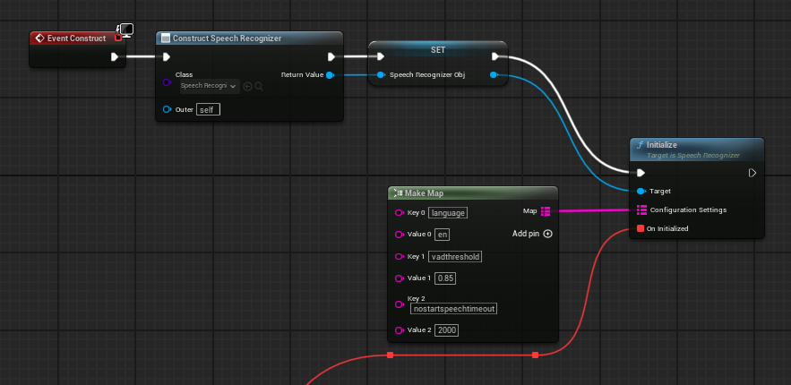
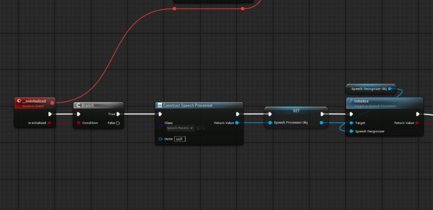
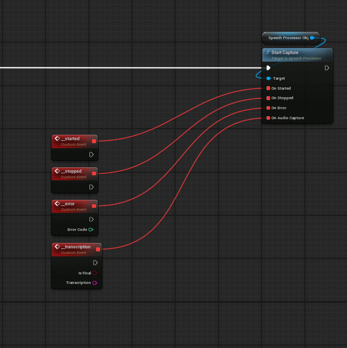
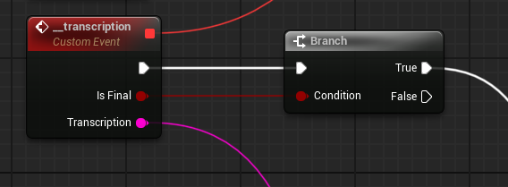
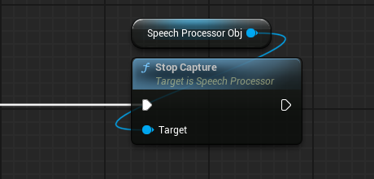

# Snapdragon Game AI - Speech Recognizer

<div align="center">


**Hardware Accelerated Speech-To-Text plugin for Unreal Engine**

Powered by Qualcomm's Voice AI SDK with NPU-accelerated models on Snapdragon platforms

[Features](#features) • [Installation](#installation) • [Quick Start](#quick-start) • [Documentation](#api-reference)

</div>

---

## Overview

This plugin provides real-time speech-to-text capabilities for Unreal Engine. Built as a wrapper around Qualcomm's Voice AI ASR SDK with support for multiple Whisper model variants.

**Leveraging Snapdragon NPU**: On Snapdragon-powered devices, the Voice AI ASR SDK takes full advantage of the Neural Processing Unit (NPU) to deliver hardware-accelerated speech recognition with exceptional performance and power efficiency.

### Key Highlights
- ⚡ **NPU-Accelerated**: Hardware acceleration on Snapdragon platforms for optimal performance
- 🔋 **Power Efficient**: NPU offloading reduces CPU/GPU load and extends battery life on mobile devices
- 🌐 **Cross-Platform**: Native support for Windows and Android
- 🧠 **Multiple Models**: Choose from small, large-turbo, and quantized Whisper variants
- 📱 **Blueprint & C++**: Full support for both Blueprint and C++ workflows

---

## Features

### Core Capabilities

- **Real-time Speech Recognition**: Convert spoken audio to text with low latency
- **Streaming Transcription**: Receive both interim and final transcription results
- **Voice Activity Detection (VAD)**: Automatic detection of speech segments with configurable thresholds
- **Multi-language Support**: Configurable language settings for international applications
- **Translation Support**: Optional translation capabilities for multilingual experiences
- **Asynchronous Processing**: Non-blocking audio processing on background threads
- **Blueprint Integration**: Full Blueprint support with delegate-based event system
- **C++ API**: Complete C++ interface for advanced integration scenarios

### Supported Models

| Model | Variant | Precision | 
|-------|------|-----------|
| [**whisper-small-fp16**](https://aihub.qualcomm.com/models/whisper_small?domain=Audio&useCase=Speech+Recognition) | Small | FP16 | 
| [**whisper-small-quantized**](https://aihub.qualcomm.com/models/whisper_small_quantized?domain=Audio&useCase=Speech+Recognition) | Small | Quantized |
| [**whisper-large-turbo-fp16**](https://aihub.qualcomm.com/models/whisper_large_v3_turbo?domain=Audio&useCase=Speech+Recognition) | Large | FP16 |

### Supported Platforms

| Platform | Architecture  | Status |
|----------|-------------|---------|
| **Windows** | ARM64, ARM64EC | ✅ Supported |
| **Android** | ARM64 (aarch64) | ✅ Supported |

## Audio Stream Requirements

|Feature   |   |
|----|----|
|Sampling Rate| 16Khz|
|Channels|Mono|
|Bit Depth| PCM 16-bit|

## Prerequisites

#### Voice AI SDK
[Download](https://qpm.qualcomm.com/#/main/tools/details/VoiceAI_ASR_Community) the Voice AI ASR SDK from Qualcomm Package Manager - [Voice AI SDK](https://qpm.qualcomm.com/#/main/tools/details/VoiceAI_ASR_Community)
#### Unreal Engine
- Developed with Unreal Engine 5.6
- Supported platforms: Win64, Android

#### Required Plugins
The following Unreal Engine plugins must be enabled:
| Plugin | Description|
|-----|----|
|**QAIRT**| Qualcomm AI Runtime for NPU acceleration|

## Installation

### Step 1: Plugin Setup

1. **Download or Clone** this SpeechRecognizer and the dependent QAIRT plugin to your project's `Plugins` directory.

### Step 2: Download Voice AI SDK

1. Download and install the **Voice AI ASR SDK** from Qualcomm Package Manager:
   [Voice AI SDK](https://qpm.qualcomm.com/#/main/tools/details/VoiceAI_ASR_Community)

2. Run `Setup.bat` to extract the required binaries.

### Step 3: Download and Place Model Artifacts

Each Whisper model requires three files placed in the `models/` directory:

```
plugin/SpeechRecognizer/Source/VoiceAI/ThirdParty/VoiceAIASRLib/models/
├── encoder_model_htp.bin
├── decoder_model_htp.bin
└── vocab.bin
```

> **Note:** The `models/` directory is intentionally kept empty in the repo. Model files are excluded from version control due to their large size.

Follow the steps below to obtain all three files.

#### Step 3a: Download Encoder and Decoder from Qualcomm AI Hub

1. Go to the Qualcomm AI Hub page for your preferred model:

    | Model | Link |
    |-------|------|
    | whisper-small-fp16 | [Download](https://aihub.qualcomm.com/models/whisper_small?domain=Audio&useCase=Speech+Recognition) |
    | whisper-small-quantized | [Download](https://aihub.qualcomm.com/models/whisper_small_quantized?domain=Audio&useCase=Speech+Recognition) |
    | whisper-large-turbo-fp16 | [Download](https://aihub.qualcomm.com/models/whisper_large_v3_turbo?domain=Audio&useCase=Speech+Recognition) |

2. Click **Download Model** on the AI Hub page.

3. In the **Download Model** dialog:
   - **Choose runtime** → Select **Qualcomm® AI Runtime** (not ONNX Runtime)
   - **Choose device** → Select your target Snapdragon device (e.g., Snapdragon® X Elite)

4. **Download the Decoder**: Select **HfWhisperDecoder** under "Choose model" and click **Download model**. 

5. **Download the Encoder**: Select **HfWhisperEncoder** under "Choose model" and click **Download model**.

6. Rename the downloaded decoder file to `decoder_model_htp.bin` and the encoder file to `encoder_model_htp.bin`, then place both in the `models/` directory.

#### Step 3b: Generate Vocabulary File

The vocabulary file is generated using a script included with the Voice AI SDK (downloaded in Step 2).

1. Navigate to the vocabulary generation folder inside the Voice AI SDK:
    ```
    VoiceAI_ASR_Community_v2.3.0.0/2.3.0.0/notebook/whisper/npu/whisper_vocab/
    ```
    This folder contains:
    ```
    whisper_vocab/
    ├── generate_whisper_vocab.py
    └── README.md
    ```

2. Follow the instructions in the `README.md` to run `generate_whisper_vocab.py` and generate the `vocab.bin` file.

3. Copy the generated `vocab.bin` into the `models/` directory.

#### Step 3c: Verify

After completing all installation steps, your `VoiceAIASRLib` directory should look like this:

```
plugin/SpeechRecognizer/Source/VoiceAI/ThirdParty/VoiceAIASRLib/
├── assets/
│   ├── data/
│   └── speech_float.eai
├── inc/
│   ├── DataAvailableListener.h
│   ├── InputStream.h
│   ├── Whisper.h
│   └── WhisperResponseListener.h
├── lib/
│   ├── android/
│   │   └── whisper_all_quantized/
│   └── windows/
│       └── whisper_all_quantized/
├── models/
│   ├── decoder_model_htp.bin
│   ├── encoder_model_htp.bin
│   └── vocab.bin
├── AndroidPackaging.xml
└── VoiceAIASRLib.Build.cs
```


## Quick Start

### Blueprint Usage

#### 1. Create Speech Recognizer Object

In your Blueprint, create a `SpeechRecognizer` object:



#### 2. On Successful initialization, Initialize the Recognizer



#### 3. Start Recognition



#### 4. Handle Transcription Results

Bind to the `On Transcription` delegate to receive results:

- __IsFinal__: Boolean indicating if this is the final result
- __Transcription__: String containing the transcribed text



#### 5. Stop Recognition

Call Stop to end the recognition session



### C++ Usage

#### 1. Include Headers
```cpp
#include "SpeechRecognizer.h"
```

#### 2. Create and Initialize
```cpp
// Create the speech recognizer
USpeechRecognizer* SpeechRecognizer = NewObject<USpeechRecognizer>();

// Configuration settings
TMap<FString, FString> Config;
Config.Add(TEXT("language"), TEXT("en"));
Config.Add(TEXT("vadthreshold"), TEXT("0.5"));

// Initialize
SpeechRecognizer->Initialize(Config, 
    FSpeechToTextOnInitializedDelegate::CreateLambda([](bool bSuccess)
    {
        if (bSuccess)
        {
            UE_LOG(LogTemp, Log, TEXT("Speech recognizer initialized successfully"));
        }
    })
);
```

#### 3. Start Recognition
```cpp
SpeechRecognizer->Start(
    // OnStarted
    FOnSpeechToTextStartedDelegate::CreateLambda([]()
    {
        UE_LOG(LogTemp, Log, TEXT("Recognition started"));
    }),

    // OnStopped
    FOnSpeechToTextStoppedDelegate::CreateLambda([]()
    {
        UE_LOG(LogTemp, Log, TEXT("Recognition stopped"));
    }),

    // OnError
    FOnSpeechToTextErrorDelegate::CreateLambda([](int ErrorCode)
    {
        UE_LOG(LogTemp, Error, TEXT("Recognition error: %d"), ErrorCode);
    }),

    // OnTranscription
    FOnSpeechToTextTranscriptionDelegate::CreateLambda([](bool bIsFinal, const FString& Text)
    {
        if (bIsFinal)
        {
            UE_LOG(LogTemp, Log, TEXT("Final: %s"), *Text);
        }
        else
        {
            UE_LOG(LogTemp, Log, TEXT("Interim: %s"), *Text);
        }
    })
);
```

#### 4. Process Audio (Optional)

If you're providing your own audio source:
```cpp
TArray<uint8> AudioBuffer; // Your audio data (16-bit PCM, 16kHz)
bool bSuccess = SpeechRecognizer->ProcessAudio(AudioBuffer);
```

#### 5. Stop Recognition
```cpp
SpeechRecognizer->Stop();
```

#### 6. Cleanup
```cpp
SpeechRecognizer->Uninitialize();
```


## API Reference

### USpeechRecognizer

Main Blueprint-accessible class for speech recognition.

#### Methods

##### `Initialize`
```cpp
void Initialize(
    const TMap<FString, FString>& ConfigurationSettings,
    const FSpeechToTextOnInitializedDelegate& OnInitialized
)
```

Initializes the speech recognizer with configuration settings.

__Parameters:__

- `ConfigurationSettings`: Map of configuration key-value pairs
- `OnInitialized`: Delegate called when initialization completes

##### `Start`
```cpp
void Start(
    const FOnSpeechToTextStartedDelegate& OnStarted,
    const FOnSpeechToTextStoppedDelegate& OnStopped,
    const FOnSpeechToTextErrorDelegate& OnError,
    const FOnSpeechToTextTranscriptionDelegate& OnTranscription
)
```

Starts a speech recognition session.

__Parameters:__

- `OnStarted`: Called when recognition starts
- `OnStopped`: Called when recognition stops
- `OnError`: Called on error (receives error code)
- `OnTranscription`: Called with transcription results (receives IsFinal flag and text)

##### `Stop`
```cpp
void Stop()
```

Gracefully stops the current recognition session.

##### `ProcessAudio`
```cpp
bool ProcessAudio(const TArray<uint8>& buffer)
```

Processes raw audio data for recognition.

__Parameters:__

- `buffer`: Audio data (16-bit PCM, 16kHz recommended)

__Returns:__ `true` if audio was queued successfully

##### `SetConfiguration`
```cpp
void SetConfiguration(const TMap<FString, FString>& ConfigurationSettings)
```

Updates configuration settings.

__Parameters:__

- `ConfigurationSettings`: Map of configuration key-value pairs

##### `Uninitialize`
```cpp
void Uninitialize()
```

Releases all resources and stops any active sessions.

### USpeechProcessor

Helper class for managing audio capture and processing.

#### Methods

##### `Initialize`
```cpp
bool Initialize(USpeechRecognizer* speechRecognizer)
```

##### `StartCapture`
```cpp
void StartCapture(
    const FOnSpeechToTextStartedDelegate& OnStarted,
    const FOnSpeechToTextStoppedDelegate& OnStopped,
    const FOnSpeechToTextErrorDelegate& OnError,
    const FOnSpeechToTextTranscriptionDelegate& OnTranscription
)
```

##### `StopCapture`
```cpp
void StopCapture()
```

## Configuration

### Configuration Settings

The speech recognizer supports the following configuration options:

#### `language`

- __Type__: String
- __Description__: Language code for recognition (e.g., "en", "es", "fr")
- __Default__: "en"
- __Example__: `Config.Add(TEXT("language"), TEXT("en"));`

#### `vadthreshold`

- __Type__: Float (as string)
- __Description__: Voice Activity Detection threshold (0.0 to 1.0)
- __Default__: Platform-specific
- __Example__: `Config.Add(TEXT("vadthreshold"), TEXT("0.85"));`
- __Note__: Lower values are more sensitive to speech

#### `translate`

- __Type__: Boolean (as string: "0"/"1")
- __Description__: Enable translation to English
- __Default__: "0"
- __Example__: `Config.Add(TEXT("translate"), TEXT("1"));`

#### `nostartspeechtimeout`

- __Type__: Integer (as string, milliseconds)
- __Description__: Sets the no-start speech timeout in milliseconds.
- __Default__: 5000 ms
- __Example__: `Config.Add(TEXT("nostartspeechtimeout"), TEXT("5000"));`

#### `partial`

- __Type__: Boolean (as string, "0"/"1")
- __Description__: Sets whether to enable partial transcriptions
- __Default__: "0"
- __Example__: `Config.Add(TEXT("partial"), TEXT("1"));`

### Configuration Example
```cpp
TMap<FString, FString> Config;
Config.Add(TEXT("language"), TEXT("en"));
Config.Add(TEXT("vadthreshold"), TEXT("0.85"));
Config.Add(TEXT("translate"), TEXT("false"));
Config.Add(TEXT("nostartspeechtimeout"), TEXT("3000"));

SpeechRecognizer->Initialize(Config, OnInitializedDelegate);
```


## Components Overview

|Component|Description|
|-----|-----|
|__USpeechRecognizer__|Blueprint-accessible UObject, Manages lifecycle and delegates, Platform-agnostic API|
|__USpeechProcessor__|Combines Audio Capture and Recognition, Feeds audio to recognizer|
|__VoiceCaptureWorker__|Background thread for audio capture|
|__VoiceAISpeechRecognizerWindows__|Windows-specific implementation|
|__VoiceAISpeechRecognizerAndroid__|Android-specific implementation|

## License
Check out the [LICENSE](https://github.com/SnapdragonGameStudios/snapdragon-game-plugins-for-unreal-engine/blob/main/LICENSE) for more details.