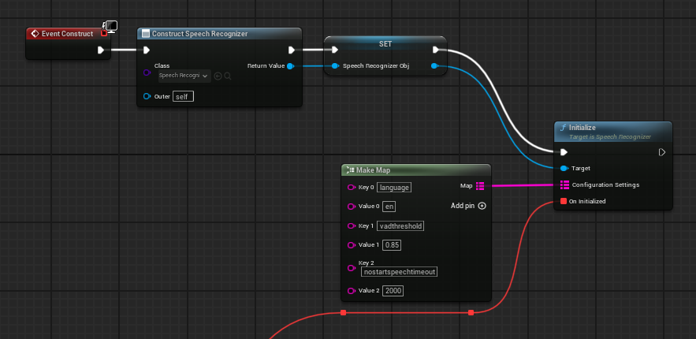
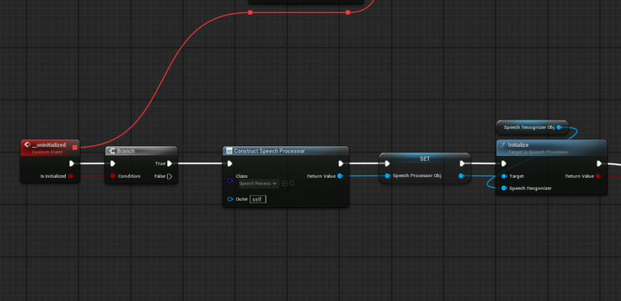
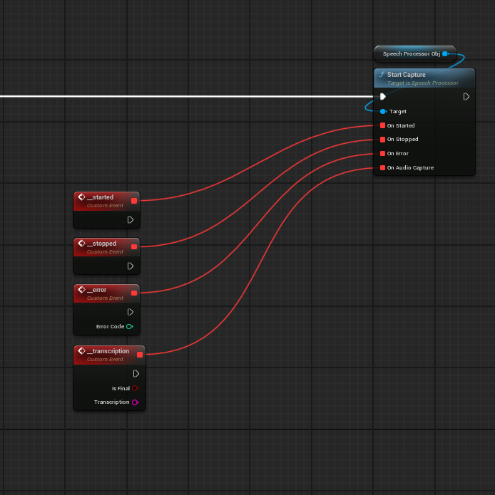
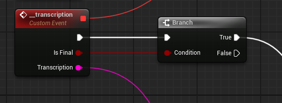
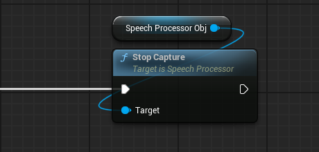

# Snapdragon Game AI - Speech Recognizer

## Overview

This plugin provides real-time speech-to-text capabilities for Unreal Engine. Built as a wrapper around Qualcomm's Voice AI ASR SDK with support for multiple Whisper model variants.

The plugin supports streaming transcription and configurable voice activity detection. Accelerator availability and performance depend on the runtime, model, and target device.

### Supported models

| Model | Variant | Precision |
|-------|------|-----------|
| [**whisper-small-fp16**](https://aihub.qualcomm.com/models/whisper_small?domain=Audio&useCase=Speech+Recognition) | Small | FP16 |
| [**whisper-small-quantized**](https://aihub.qualcomm.com/models/whisper_small_quantized?domain=Audio&useCase=Speech+Recognition) | Small | Quantized |
| [**whisper-large-turbo-fp16**](https://aihub.qualcomm.com/models/whisper_large_v3_turbo?domain=Audio&useCase=Speech+Recognition) | Large | FP16 |

### Supported platforms

| Platform | Architecture  | Status |
|----------|-------------|---------|
| **Windows** | ARM64, ARM64EC |  Supported |
| **Android** | ARM64 (aarch64) |  Supported |

## Audio input requirements

|Feature   |   |
|----|----|
|Sampling Rate| 16 kHz|
|Channels|Mono|
|Bit Depth| PCM 16-bit|

## Prerequisites

#### Voice AI SDK
[Download](https://qpm.qualcomm.com/#/main/tools/details/VoiceAI_ASR) the Voice AI ASR SDK from Qualcomm Package Manager - [Voice AI SDK](https://qpm.qualcomm.com/#/main/tools/details/VoiceAI_ASR)
#### Unreal Engine
- Developed with Unreal Engine 5.6
- Supported platforms: Win64, Android

#### Required plugins
The following Unreal Engine plugins must be enabled:
| Plugin | Version | Description|
|-----|----|----|
|**[QAIRT](https://github.com/SnapdragonGameStudios/snapdragon-game-plugins-for-unreal-engine/tree/engine/5.6/Plugins/SGAI/qairt)**| v2.45+ | Qualcomm AI Runtime for NPU acceleration|

## Installation

### Copy the plugins

1. **Download or Clone** this SpeechRecognizer and the dependent QAIRT plugin to your project's `Plugins` directory.

### Install the Voice AI SDK

1. Download and install the **Voice AI ASR SDK** from Qualcomm Package Manager:
   [Voice AI SDK](https://qpm.qualcomm.com/#/main/tools/details/VoiceAI_ASR)

2. Run `Setup.bat` to extract the required binaries.

### Step 3: Download and Place Model Artifacts

Each Whisper model requires three files placed in the `models/` directory:

```text
plugin/SGAISpeechRecognizer/Source/VoiceAIASR/ThirdParty/VoiceAIASRLib/models/
├── encoder.bin
├── decoder.bin
└── vocab.bin
```

> **Note:** The `models/` directory is intentionally kept empty in the repo. Model files are excluded from version control due to their large size.

> **Note:** On Android, the model files aren't packaged into the APK by default. For the sample, manual push the files to the following location.
```text
/sdcard/Android/data/<packagename>/files/UnrealGame/SpeechRecognizerSample/SpeechRecognizerSample/models
```

Follow the steps below to obtain all three files.

#### Download model artifacts Encoder and Decoder from Qualcomm AI Hub

1. Go to the Qualcomm AI Hub page for your preferred model:

    | Model | Link |
    |-------|------|
    | whisper-small-fp16 | [Download](https://aihub.qualcomm.com/models/whisper_small?domain=Audio&useCase=Speech+Recognition) |
    | whisper-small-quantized | [Download](https://aihub.qualcomm.com/models/whisper_small_quantized?domain=Audio&useCase=Speech+Recognition) |
    | whisper-large-turbo-fp16 | [Download](https://aihub.qualcomm.com/models/whisper_large_v3_turbo?domain=Audio&useCase=Speech+Recognition) |

2. Click **Download Model** on the AI Hub page.

3. In the **Download Model** dialog:
   - **Choose runtime** → Select **Qualcomm® Voice AI**
   - **Choose device** → Select your target Snapdragon device (e.g., Snapdragon® X Elite)

4. Place the 3 files in the `models/` directory.
   - `decoder.bin`
   - `encoder.bin`
   - `vocab.bin`

#### Step 3c: Verify

After completing all installation steps, your `VoiceAIASRLib` directory should look like this:

```text
plugin/SGAISpeechRecognizer/Source/VoiceAIASR/ThirdParty/VoiceAIASRLib/
├── assets/
├── inc/
│   ├── DataAvailableListener.h
│   ├── InputStream.h
│   ├── Whisper.h
│   └── WhisperResponseListener.h
├── lib/
│   ├── android/
│   │   └── arm64-v8a/
|   |   └── whispersdk.jar
│   └── windows/
│       └── ARM64/
│       └── ARM64X/
├── models/
│   ├── decoder.bin
│   ├── encoder.bin
│   └── vocab.bin
├── AndroidPackaging.xml
└── VoiceAIASRLib.Build.cs
```

## Quick start

### Blueprint usage

#### Create the recognizer

In your Blueprint, create a `SpeechRecognizer` object:



#### Handle initialization



#### Start recognition



#### Handle transcription

Bind to the `On Transcription` delegate to receive results:

- __IsFinal__: Boolean indicating if this is the final result
- __Transcription__: String containing the transcribed text



#### Stop recognition

Call Stop to end the recognition session



### C++ usage

Create a `USpeechRecognizer` with `NewObject<USpeechRecognizer>(Owner)` and retain it in a `UPROPERTY`. Call `Initialize` with `FSpeechRecognizerSettings` and wait for `FSpeechToTextOnInitializedDelegate` to report success.

Call `Start` with delegates for started, stopped, error, and transcription events. Feed mono, 16 kHz, 16-bit PCM buffers through `ProcessAudio`. For microphone capture, use `USpeechProcessor` with the initialized recognizer and call `StartCapture` instead of supplying buffers yourself. Ensure the application has microphone permission.

These callbacks are dynamic delegates. Bind them to matching `UFUNCTION` handlers with `BindDynamic`; `CreateLambda` is not supported. `FOnSpeechToTextTranscriptionDelegate` supplies a final-result flag and the transcription text.

Stop capture or recognition before calling `Uninitialize`. Keep the recognizer and processor alive while asynchronous operations are pending.

See the checked-in declarations for [recognizer methods and delegates](Source/SGAISpeechRecognizer/Public/SpeechRecognizer.h), [microphone capture](Source/SGAISpeechRecognizer/Public/SpeechProcessor.h), and [settings](Source/SGAISpeechRecognizer/Public/ISpeechRecognizer.h).

## Validation

Test microphone permission, model loading, interim and final transcription, stopping, and cleanup on the target device. Check the model and runtime versions when initialization fails. Use the [sample project](../../../Samples/SGAI/SpeechRecognizerSample/) as the Blueprint integration reference.

## License

Plugin source uses the repository [BSD 3-Clause license](../../../LICENSE). Voice AI, QAIRT, and model artifacts have separate terms and required notices.
