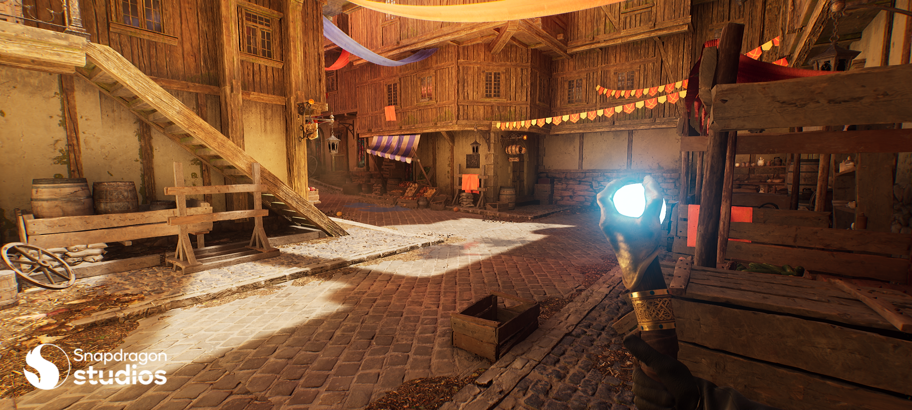
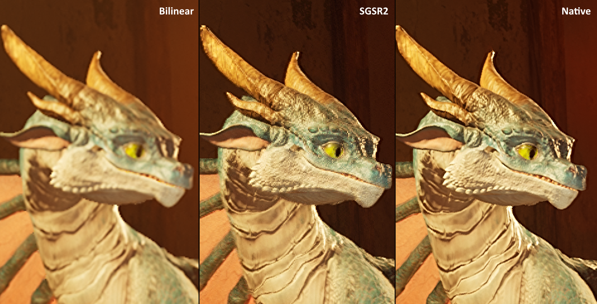

<!-- omit in toc -->
# Snapdragon™ Game Plugins for Unreal Engine

<!-- omit in toc -->
### Table of contents

- [Introduction](#introduction)
- [Usage Instructions](#usage-instructions)
- [List of Plugins](#list-of-plugins)
	- [Snapdragon™ Game Super Resolution](#snapdragon-game-super-resolution)
		- [Snapdragon™ Game Super Resolution 2](#snapdragon-game-super-resolution-2)
		- [Snapdragon™ Game Super Resolution 1](#snapdragon-game-super-resolution-1)
	- [Adreno™ Neural Fusion](#adreno-neural-fusion)
	- [Qualcomm™ NPE Plugin](#qualcomm-npe-plugin)
	- [Qualcomm™ Shadow Denoiser](#qualcomm-shadow-denoiser)
	- [Snapdragon™ Game AI SDK](#snapdragon-game-ai-sdk)
		- [Speech Recognizer](#speech-recognizer)
		- [LLM Pipelines](#llm-pipelines)
		- [Text to Speech](#text-to-speech)
- [Contributing](#contributing)
- [License](#license)

# Introduction

This repository is a collection of plugins for the Unreal Engine, developed and authored by the Snapdragon™ Studios team.

This component is part of the [Snapdragon™ Game Toolkit](https://www.qualcomm.com/developer/snapdragon-game-toolkit).

# Usage Instructions

Select the branch matching your Unreal Engine version. The `main` and `engine/*` branches share this catalog; it lists plugins across the repository.

- Engine-versioned collections keep plugins in the `Plugins` directory.
- Specialized branches have their own plugin folders, installation guides, and engine patches.
- Follow the README for the selected plugin before copying it into an engine or project.

# List of Plugins

## Snapdragon™ Game Super Resolution

*Available Engine Versions:*

#### UE4:

| [4.27 SGSR1](https://github.com/SnapdragonGameStudios/snapdragon-game-plugins-for-unreal-engine/tree/engine/4.27/Plugins/SGSR) | [4.27 SGSR2](https://github.com/SnapdragonGameStudios/snapdragon-game-plugins-for-unreal-engine/tree/engine/4.27/Plugins/SGSR2) |
|------|------|

#### UE5 SGSR1 & SGSR2:

 |[5.0][SGSR_UE5_Link] | [5.1][SGSR_UE5_Link] | [5.2][SGSR_UE5_Link] | [5.3][SGSR_UE5_Link] | [5.4][SGSR_UE5_Link] | [5.5][SGSR_UE5_Link] | [5.6][SGSR_UE5_Link] | [5.7][SGSR_UE5_Link] | [5.8][SGSR_UE5_Link] |
|-----|-----|-----|-----|-----|-----|-----|-----|-----|

[SGSR_UE5_Link]: https://github.com/SnapdragonGameStudios/snapdragon-game-plugins-for-unreal-engine/tree/SGSR_UE5

### Snapdragon™ Game Super Resolution 2

 

Snapdragon™ Game Super Resolution 2 (Snapdragon™ GSR 2 or just SGSR 2) was developed by Qualcomm Snapdragon™ Game Studios; it's our temporal upscaling solution optimized for Adreno GPUs.

Snapdragon™ GSR 2 uses temporal inputs to reconstruct a higher-resolution image while reducing aliasing, flicker, and ghosting.

The UE5 plugin provides a two-pass fragment path and a three-pass compute path. Compare image quality and GPU time on the target device when choosing a path.

Check motion vectors, jitter, and disoccluded regions when validating Snapdragon™ GSR 2 in a renderer.

 
 

For technique details and standalone shaders, see the [Snapdragon Game Super Resolution](https://github.com/SnapdragonGameStudios/snapdragon-gsr) repository.
### Snapdragon™ Game Super Resolution 1
Snapdragon™ Game Studios developed Snapdragon™ Game Super Resolution 1 (Snapdragon™ GSR 1 or SGSR1), which integrates upscaling and sharpening in one single GPU shader pass. The algorithm uses a 12-tap Lanczos-like scaling filter and adaptive sharpening filter, which presents smooth images and sharp edges.

Our solution provides an efficient solution for games to draw 2D UI at device resolution for better visual quality, while rendering the 3D scene at a lower resolution for performance and power savings.

The technique is optimized for Adreno™ GPU hardware. Compare its output and cost with the project's existing upscaler.

For technique details and standalone shaders, see the [Snapdragon Game Super Resolution](https://github.com/SnapdragonGameStudios/snapdragon-gsr) repository.

## Adreno™ Neural Fusion

*Available Unreal Engine Versions:*

| [5.0](https://github.com/SnapdragonGameStudios/snapdragon-game-plugins-for-unreal-engine/tree/ANF_UE5) | [5.1](https://github.com/SnapdragonGameStudios/snapdragon-game-plugins-for-unreal-engine/tree/ANF_UE5) | [5.2](https://github.com/SnapdragonGameStudios/snapdragon-game-plugins-for-unreal-engine/tree/ANF_UE5) | [5.3](https://github.com/SnapdragonGameStudios/snapdragon-game-plugins-for-unreal-engine/tree/ANF_UE5) | [5.4](https://github.com/SnapdragonGameStudios/snapdragon-game-plugins-for-unreal-engine/tree/ANF_UE5) | [5.5](https://github.com/SnapdragonGameStudios/snapdragon-game-plugins-for-unreal-engine/tree/ANF_UE5) | [5.6](https://github.com/SnapdragonGameStudios/snapdragon-game-plugins-for-unreal-engine/tree/ANF_UE5) | [5.7](https://github.com/SnapdragonGameStudios/snapdragon-game-plugins-for-unreal-engine/tree/ANF_UE5) | [5.8](https://github.com/SnapdragonGameStudios/snapdragon-game-plugins-for-unreal-engine/tree/ANF_UE5) |
|-----|-----|-----|-----|-----|-----|-----|-----|-----|

 

Adreno™ Neural Fusion brings neural rendering features to Unreal Engine games on Android Vulkan. Super Resolution reconstructs a higher-resolution image from a lower-resolution render, while Frame Generation creates an additional frame to make motion feel smoother. These modes are used independently, so choose the one that fits your game's needs.

The [ANF_UE5](https://github.com/SnapdragonGameStudios/snapdragon-game-plugins-for-unreal-engine/tree/ANF_UE5) branch contains the plugin, installation guidance, SDK documentation, and UE 5.0–5.8 engine patches.

## Qualcomm™ NPE Plugin

*Available Engine Versions:*

| [5.3](https://github.com/SnapdragonGameStudios/snapdragon-game-plugins-for-unreal-engine/tree/engine/5.3/Plugins/SNPE) | [5.4](https://github.com/SnapdragonGameStudios/snapdragon-game-plugins-for-unreal-engine/tree/engine/5.4/Plugins/SNPE) |
|------|------|

Plugin for Neural Network Inference using the Qualcomm™ Neural Processing SDK (also known as SNPE).

This plugin enables hardware acceleration of AI model inference on devices with Qualcomm® Hexagon™ Processors.

## Qualcomm™ Shadow Denoiser

*Available Engine Versions:*

| [5.5](https://github.com/SnapdragonGameStudios/snapdragon-game-plugins-for-unreal-engine/tree/engine/5.5/Plugins/QcomShadowDenoiser) |
|------|

Plugin for reducing noise in ray-traced shadows on both desktop and mobile renderers, with optimizations for Qualcomm® Adreno™ GPUs.

## Snapdragon™ Game AI SDK
*Available Engine Versions:*

| [5.6](https://github.com/SnapdragonGameStudios/snapdragon-game-plugins-for-unreal-engine/tree/engine/5.6/Plugins/SGAI) | [5.7](https://github.com/SnapdragonGameStudios/snapdragon-game-plugins-for-unreal-engine/tree/engine/5.7/Plugins/SGAI) |
|------|------|

Snapdragon™ Game AI SDK provides speech recognition, LLM inference, and text-to-speech through Unreal Engine plugins.

### Speech Recognizer

| [5.6](https://github.com/SnapdragonGameStudios/snapdragon-game-plugins-for-unreal-engine/tree/engine/5.6/Plugins/SGAI/SGAISpeechRecognizer) | [5.7](https://github.com/SnapdragonGameStudios/snapdragon-game-plugins-for-unreal-engine/tree/engine/5.7/Plugins/SGAI/SGAISpeechRecognizer) |
|------|------|

Convert player voice input into text with speech recognition.
- Real-time voice-to-text conversion
- NPU inference on supported devices using Qualcomm's Voice AI SDK
### LLM Pipelines

| [5.6](https://github.com/SnapdragonGameStudios/snapdragon-game-plugins-for-unreal-engine/tree/engine/5.6/Plugins/SGAI/SGAILLMPipelines) | [5.7](https://github.com/SnapdragonGameStudios/snapdragon-game-plugins-for-unreal-engine/tree/engine/5.7/Plugins/SGAI/SGAILLMPipelines) |
|------|------|

Use large language models for conversations, tool calls, embeddings, and retrieval.
- C++ and Blueprint interfaces for LLM integration
- NPU LLM inference on supported devices using Qualcomm's Genie SDK.
### Text to Speech

| [5.6](https://github.com/SnapdragonGameStudios/snapdragon-game-plugins-for-unreal-engine/tree/engine/5.6/Plugins/SGAI/SGAITextToSpeech) | [5.7](https://github.com/SnapdragonGameStudios/snapdragon-game-plugins-for-unreal-engine/tree/engine/5.7/Plugins/SGAI/SGAITextToSpeech) |
|------|------|

Generate speech from text using the Voice AI TTS SDK.
- Real-time audio generation
- NPU inference on supported devices using Qualcomm's Voice AI SDK
# Contributing

Read [CONTRIBUTING.md](CONTRIBUTING.md) for contribution and sign-off requirements and the [code of conduct](CODE-OF-CONDUCT.md) for participation guidelines.

# License

Applicable plugin source uses the [BSD 3-Clause License](LICENSE). SDK binaries, models, and third-party dependencies may have separate terms. Follow the selected plugin's license and notice requirements when redistributing it.
