# Snapdragon Game AI - LLMPipelinesSample

[](https://www.unrealengine.com/)
[](../LICENSE)
[](#platform-support)

A sample Unreal Engine 5.6 project demonstrating the **LLMPipelines** plugin for integrating Large Language Models into gameplay. This sample showcases multi-turn conversations with optional tool calling, powered by Qualcomm's Genie framework with CPU and NPU acceleration support.

## Platform Support

- **Windows x64** - Full support with CPU and NPU acceleration
- **Windows ARM64** - Emulated support via ARM64X with CPU and NPU acceleration

Both platforms support Genie-compatible models with hardware-accelerated inference.

---

## Features

✨ **Multi-turn Conversations** - Natural dialogue with context retention across multiple exchanges

🔧 **Tool Calling & Execution** - LLMs can invoke Blueprint-implemented tools (e.g., controlling lights, querying game state)

🎮 **Blueprint Component Integration** - Drop-in components (`BPC_LLM_Chat`, `BPC_LLM_RAG`) for easy integration into any project

🚀 **Hardware Acceleration** - CPU and NPU accelerated inference via Qualcomm Genie

📚 **RAG Support** - Reference implementation for Retrieval-Augmented Generation workflows (embeddings + vector DB)

---

## Prerequisites

Before running this sample, ensure you have:

1. **Unreal Engine 5.6** installed
2. **Genie-compatible models** - Download from [Qualcomm AI Hub](https://aihub.qualcomm.com/) or compatible model repositories
3. **Genie/tokenizer configurations** - Obtain the required `.json` configuration files for your chosen model

> **Note**: The plugin README contains detailed information about model compatibility and configuration requirements.

---

## Quick Start

### Getting Models and Configs

1. **Download a Genie-compatible model** from [Qualcomm AI Hub](https://aihub.qualcomm.com/)
   - Recommended: Start with a smaller model (e.g., 1-3B parameters) for testing
   - Ensure the model includes both the model files and tokenizer configuration

2. **Locate your model folder** containing:
   - Model binary files (`.bin` or similar)
   - Genie configuration file (**has to be named exactly** `llm.json`)
   - Tokenizer configuration file (**has to be named exactly** `tokenizer_config.json`)

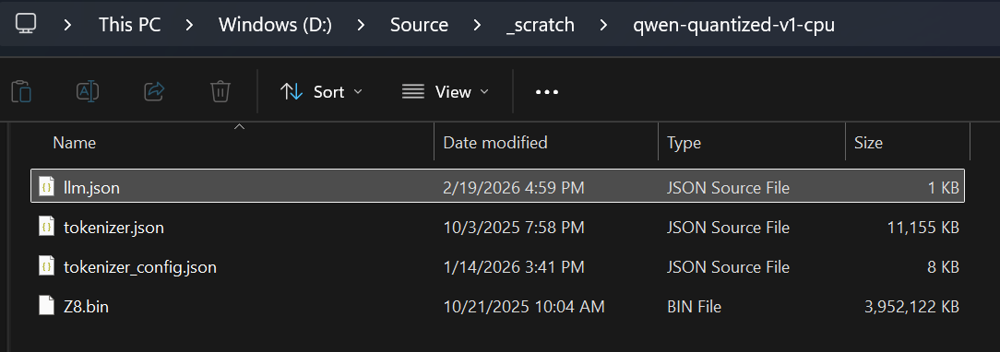
*Example: Typical model folder structure with required configuration files*

### Setting Model Paths

You can specify the model location using either of these methods:

#### Method 1: Editor (Instance-Editable Variables)

1. Open the level in the Unreal Editor
2. Select an NPC actor (e.g., `BP_NPC_Minimalist` or `BP_NPC_Engineer`)
3. In the Details panel, find the **Model Folder** property
4. Set the path to your model directory

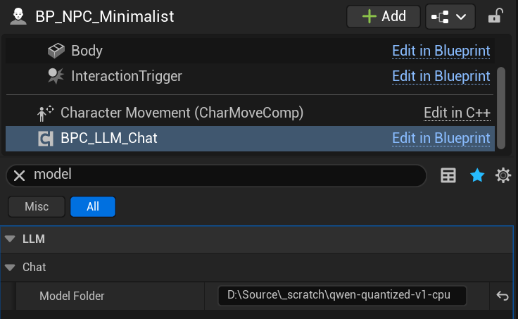
*Setting the model path via instance-editable variables in the Editor*

#### Method 2: Command Line

Launch the game with the `-ModelFolder` parameter:

```bash
UE-LLMPipelinesSample.exe -ModelFolder="Your/Model/Folder"
```

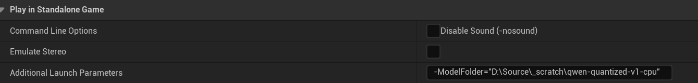
*Example: Launching with command-line model path specification via Editor Preferences -> Level Editor -> Play*

### Running the Sample

1. **Start the game** using either method above
2. **Wait for initialization** - The chat system will initialize in the background (watch for green on-screen messages)
3. **Approach an NPC** - Walk up to one of the interactive stations
4. **Press the interaction key** to begin

### Sample Stations

The sample includes two demonstration stations showcasing different capabilities:

#### Station 1: Chat - Minimalist AI

A simple conversational AI that demonstrates basic multi-turn dialogue.

- **What to try**: Have a casual conversation, ask questions, discuss topics
- **Demonstrates**: Context retention, natural language understanding, response generation

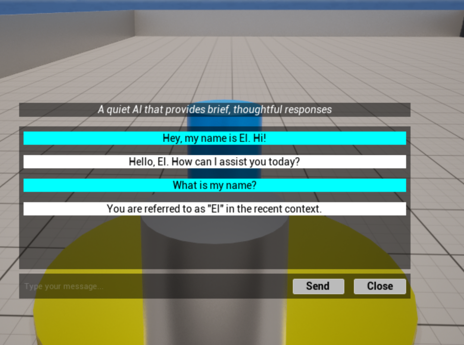
*Example conversation with the minimalist AI at Station 1*

#### Station 2: Tools - Engineer AI

An AI with tool-calling capabilities that can control the environment.

- **What to try**: Ask the AI to "turn on the red light" or "turn off the blue light"
- **Demonstrates**: Tool calling, Blueprint tool execution, environment interaction

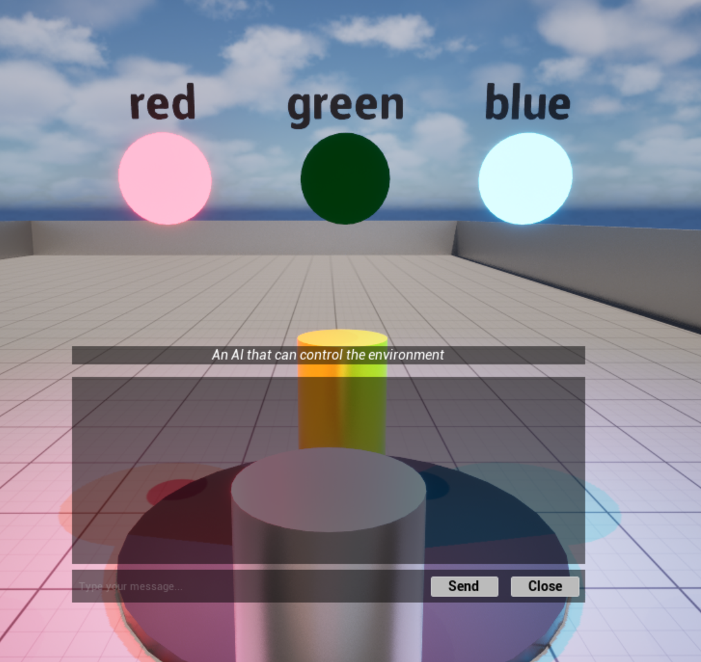
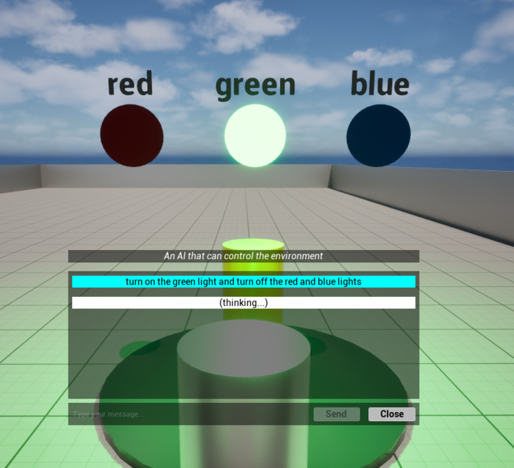
*The Engineer AI controlling lights through tool calls at Station 2*

#### Interaction Notes

- **Close Button**: Hitting the Close button will **abort** any ongoing LLM operation and **reset** the conversation
- **Conversation History**: Each station maintains its own conversation context until reset

---

## Blueprint Components

The sample demonstrates two main Blueprint Components that can be easily integrated into your own projects:

### BPC_LLM_Chat - Conversation Engine

The primary component for implementing LLM-powered conversations with optional tool calling support. Demonstrates how to manage a `ConversationEngine` object (and the related `LLMModel` and tool definition / execution objects) from Blueprints.

#### Workflows

##### Initialize

Sets up the conversation engine with model configuration and system prompts.

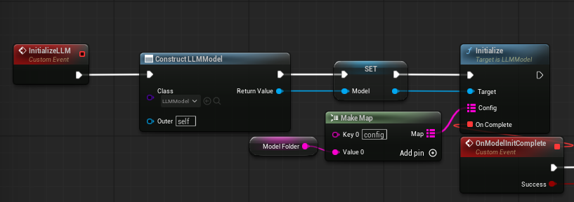
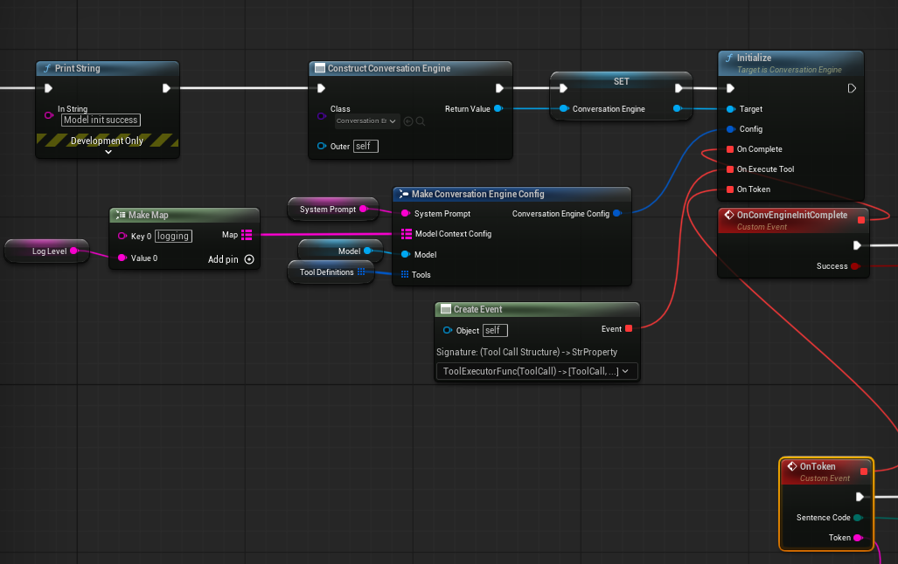
*Initialize workflow: Loading LLM model, loading conversation engine using the model, registering tool executor and token callbacks*

##### Query

Sends a user message and receives an AI response, with optional tool calling.

##### Abort

Cancels any ongoing LLM operation immediately.

##### Reset

Clears conversation history and resets the conversation state.

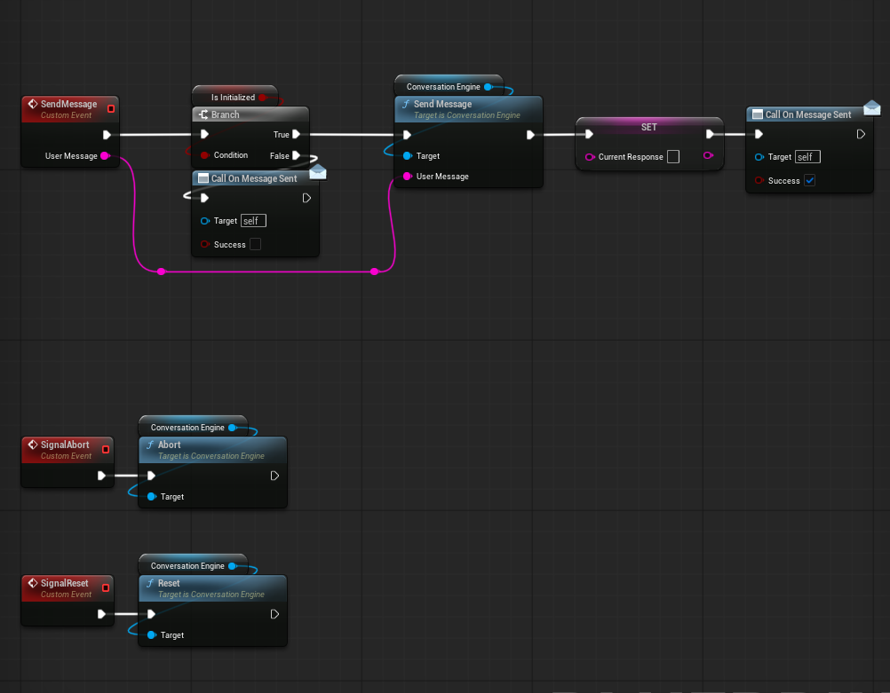
*Query, abort & reset workflow*

##### Tool Call Executor Setup

Implementing tool execution in Blueprint using the required tool call function interface.

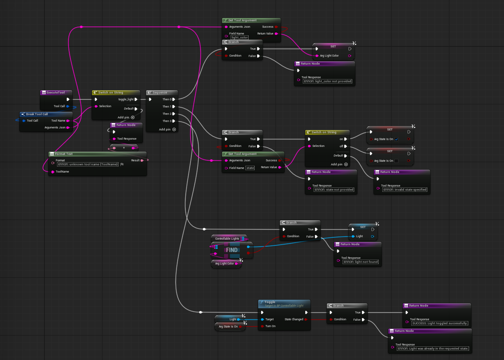
*Implementing tool call interface to handle tool calls from the LLM (the Conversation Engine input event for this was a small wrapper around the function in the diagram)*

**Example: Light Control Tool** (from Station 2)
```
Tool Name: "toggle_light"
Parameters: {"light_color": "red", "state": "on"}
Execution: Find selected light → Set intensity
Result: "SUCCESS: Light toggled successfully"
```

The LLM receives the result and can incorporate it into its next response, creating a natural interaction loop.

---

### BPC_LLM_RAG - RAG Reference Implementation

A reference component demonstrating Retrieval-Augmented Generation workflows. Demonstrates how to manage an `Embedder` and a `VectorDB` object from Blueprints.

**Note**: This component is present in the sample but not actively used in the gameplay demonstrations.

#### Workflows

##### Initialize

Sets up the embedder and vector DB with the required configurations.

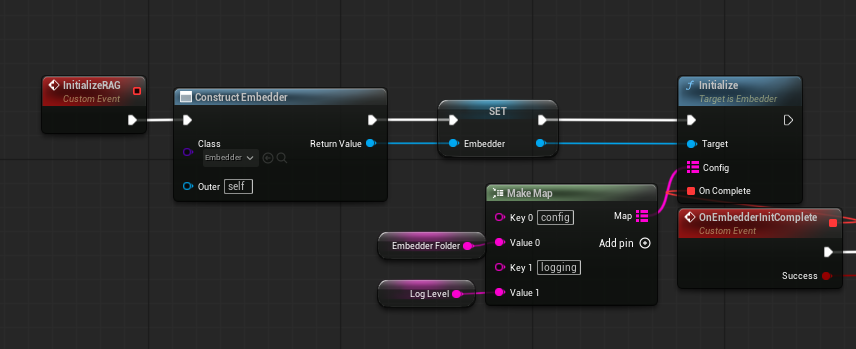
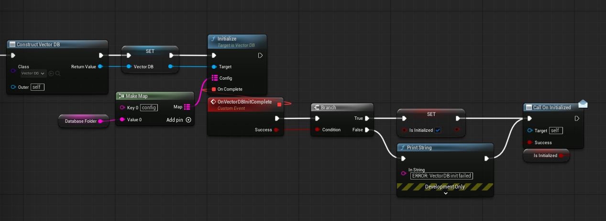
*Initialize workflow: Creating and initializing Embedder and VectorDB objects from model and database files*

##### RAG: Embedding Generation + Vector DB Query

Creates vector embeddings from text for semantic search and retrieval, and then queries the vector database to find semantically similar content.

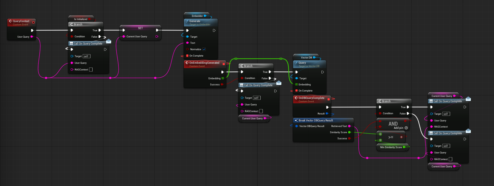
*RAG workflow: Generate embedding and query vector DB for semantic search and retrieval*
